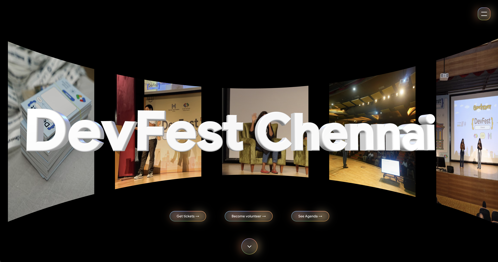

# DevFest 2026 Chennai Website



Enter the DevFest experience!

Built with Next.js, GSAP, Lenis and Three.js. Runs on Cloudflare Workers via
[`@opennextjs/cloudflare`](https://opennext.js.org/cloudflare), with D1
(accounts + tickets) and R2 (ISR cache).

## Local development

```bash
npm install
cp .env.example .env.local   # fill AUTH_SECRET + the two Google values
npm run dev                  # http://localhost:3000
```

`DB` is only touched after a real Google login, so everything else works
without D1 configured locally.

## Docs

| | |
|---|---|
| [`docs/deployment.md`](docs/deployment.md) | Cloudflare setup, the two Workers, secrets, migrations, Google auth |
| [`docs/environment.md`](docs/environment.md) | Every environment variable — type, home, example |
| [`docs/accounts-and-favorites.md`](docs/accounts-and-favorites.md) | Google sign-in + saved sessions internals |
| [`docs/markdown-negotiation.md`](docs/markdown-negotiation.md) | The `/md/*` markdown twins |
| [`devfest-2026-site-architecture.md`](devfest-2026-site-architecture.md) | Route map, the motion system, content model, audit log |
| [`workers/ticketing/README.md`](workers/ticketing/README.md) | The KonfHub webhook Worker |

## Common commands

```bash
npm run dev                      # Next dev server
npm run preview                  # build + run on the local Workers runtime
npm run deploy                   # build + deploy the site to Cloudflare
npm run worker:ticketing:deploy  # deploy the standalone ticketing Worker
npm run lint
```
